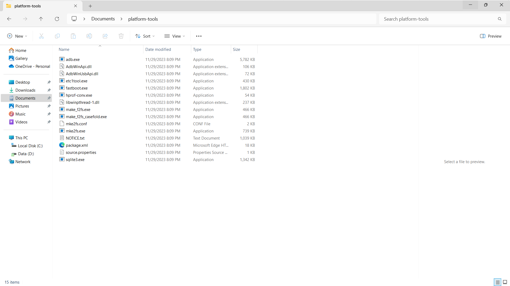
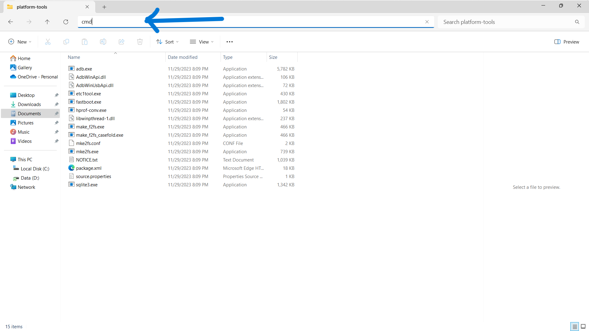
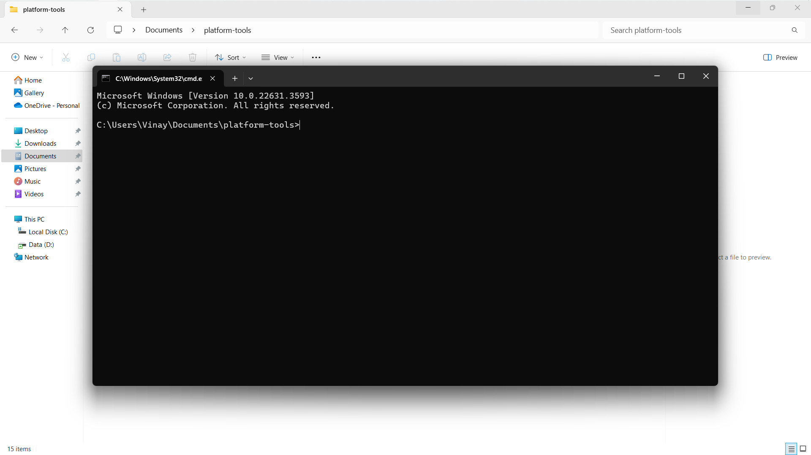
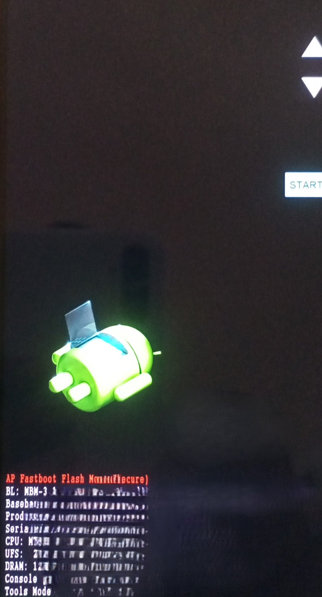
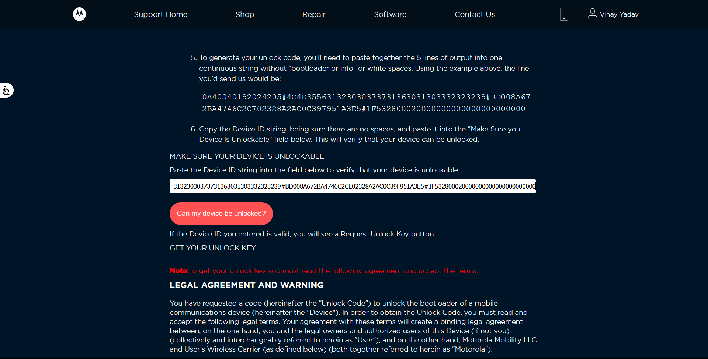

# Bootloader Unlocking Guide

## Prerequisites

To follow along the upcoming procedures you need

- A Personal Computer (PC)
- Platform Tools
- Moto USB Drivers
- Patience

### Procedure (Follow along)

#### Step 1: Get Moto USB Drivers

- Download Motorola USB Drivers from [here](https://en-us.support.motorola.com/app/usb-drivers)
- Then install them

#### Step 2: Setup platform tools

- Download the platform tools from [Here](http://developer.android.com/sdk/index.html)
- Locate the downloaded archive and extract it

{ style="width: 75%; display: block; margin-left: auto; margin-right: auto;" }

- Open a command prompt in platform-tools folder
  - Open the `platform-tools` folder
  - Click on the URL bar of the file explorer
  - Type `cmd` and press Enter

{ style="width: 75%; display: block; margin-left: auto; margin-right: auto;" }

- It will open a command prompt window like below

{ style="width: 75%; display: block; margin-left: auto; margin-right: auto;" }

#### Step 3: Unlocking Bootloader

##### 1. Enable OEM Unlocking

- Turn on `OEM Unlocking` in `Settings/Developer Options`

##### 2. Sign in to motorola

- Open Motorola Website using [this link](https://motorola-global-portal.custhelp.com/app/standalone/bootloader/unlock-your-device-b) and Sign in

##### 3.Booting to Booloader mode

- Reboot to bootloader mode using any of the two methods given below

  - Method 1: Power off the device and hold the `volume down` and `power` buttons simultaneously.  
  - Method 2: Connect your phone to PC via an USB Cable
    - Open `command prompt` in `platform-tools` folder ([Step 2](#step-1-get-moto-usb-drivers))
    - Type the command `adb reboot bootloader` and hit Enter

The phone would ultimately boot to a screen like below

{ style="width: 50%; display: block; margin-left: auto; margin-right: auto;" }

- Connect your phone to PC if you haven't

##### 4.Retrieve Unlock Information

- Open a command prompt if not opened ([Step 2](#step-1-get-moto-usb-drivers))
- Type the command `fastboot oem get_unlock_data` and hit enter.
- Copy Unlock Data
  - You will see output similar to this:

```
(bootloader) 0A40040192024205#4C4D3556313230
(bootloader) 30373731363031303332323239#BD00
(bootloader) 8A672BA4746C2CE02328A2AC0C39F95
(bootloader) 1A3E5#1F53280002000000000000000
(bootloader) 0000000
```

- Combine these lines into one continuous string without "bootloader" or spaces.  
    e.g., `0A40040192024205#4C4D355631323030373731363031303332323239#BD008A672BA4746C2CE02328A2AC0C39F951A3E5#1F532800020000000000000000000000`

##### 5.Submit unlock data

- Paste the combined string on the site you logged into earlier.
- Click "Can my device be unlocked?" and agree to the terms
- You will receive an unlock key via email.

   { style="width: 75%; display: block; margin-left: auto; margin-right: auto;" }

##### 6. Unlock Bootloader

- After receiving the unlock key do the following
  - In the command prompt type `fastboot oem unlock <your_received_key>`
  - Repace <your_received_key> with the unlock code from the email
  - Confirm the unlock on your phone via power buttons

!!! success "Congratulations!!"
    Your bootloader has been unlocked successfully
