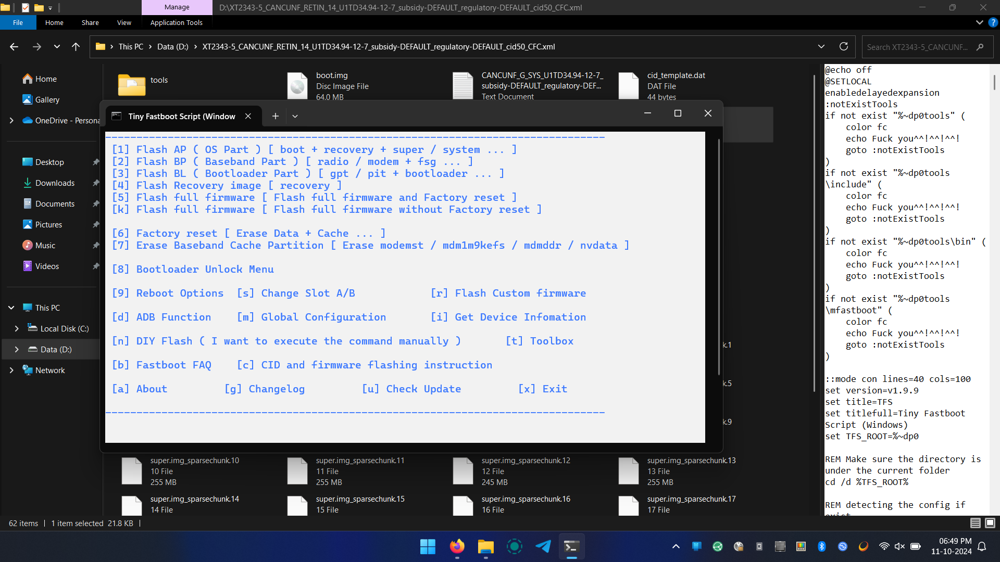

# Fix empty slot issue in Moto G54 5G

## Prerequisites

- Tiny fastboot script: [Download](https://mirrors.lolinet.com/software/windows/TinyFastbootScript)
- Your device firmware (a version older than the one you wish to be): [Download](https://mirrors.lolinet.com/firmware/lenomola/)
!!! info "Info"
    Verify the software channel of your device and download the firmware accordingly.

## Check if you have an Empty slot

- Connect your device with a PC in fastboot mode.
- Open command prompt
Type the following command and hit enter

```
fastboot getvar all
```

You will get output about slot informations, like this

```
(bootloader) slot-successful:_a: yes

(bootloader) slot-successful:_b: no

(bootloader) slot-unbootable:_a: no

(bootloader) slot-unbootable:_b: yes
```

- Check the lines with slot_unbootable
- If it says "yes" then you need to fix it

## Fixing of empty slot(s)

To fix empty slot, follow the steps below:

- Extract both Tiny Fastboot Script and Firmware in the same folder.

.png){ style="width: 75%; display: block; margin-left: auto; margin-right: auto;" }

- Run flash.bat

- Use the default bootloader version (1st option)

- Press 5 to flash full firmware and factory reset.

{ style="width: 75%; display: block; margin-left: auto; margin-right: auto;" }

- Wait for the process to complete.
- Reboot your device into system and complete the setup process.
- Go to settings and check for system update.
- Install the update and reboot your device.

!!! success "Enjoy Flashing"
    Now both of your slots are filled and you can install Custom ROM without any issues.
