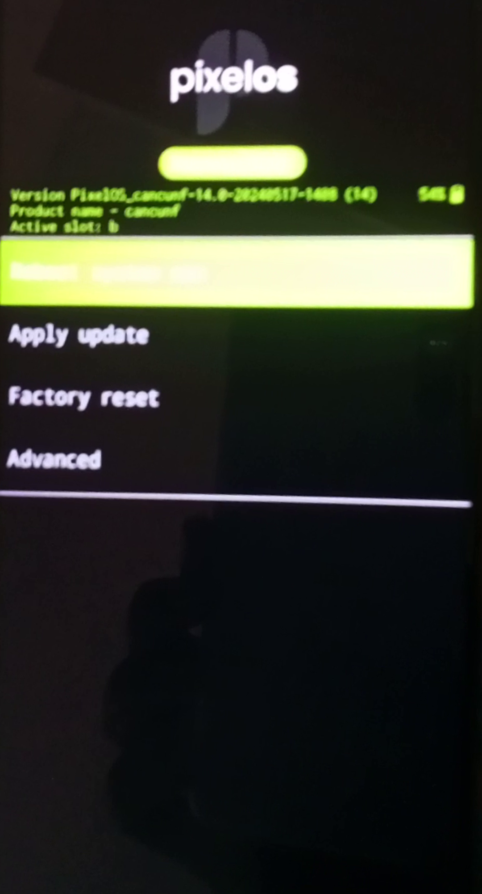
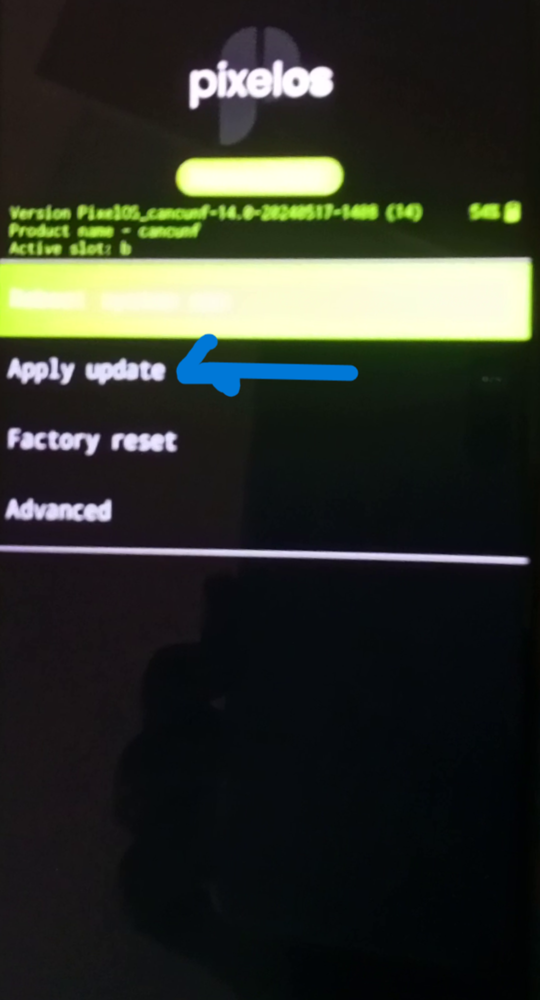
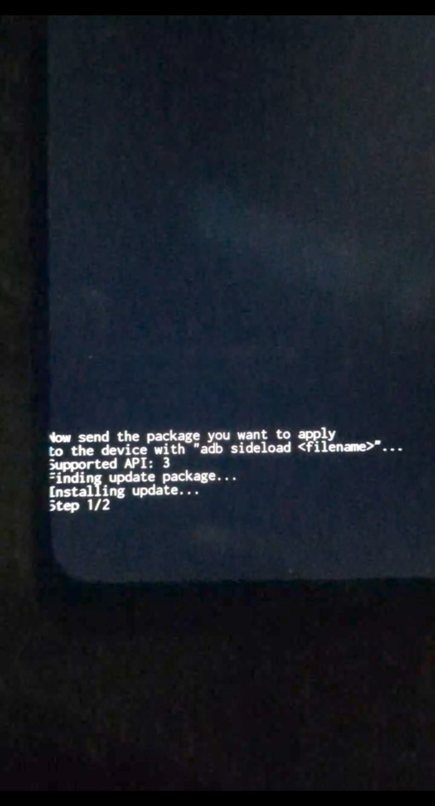
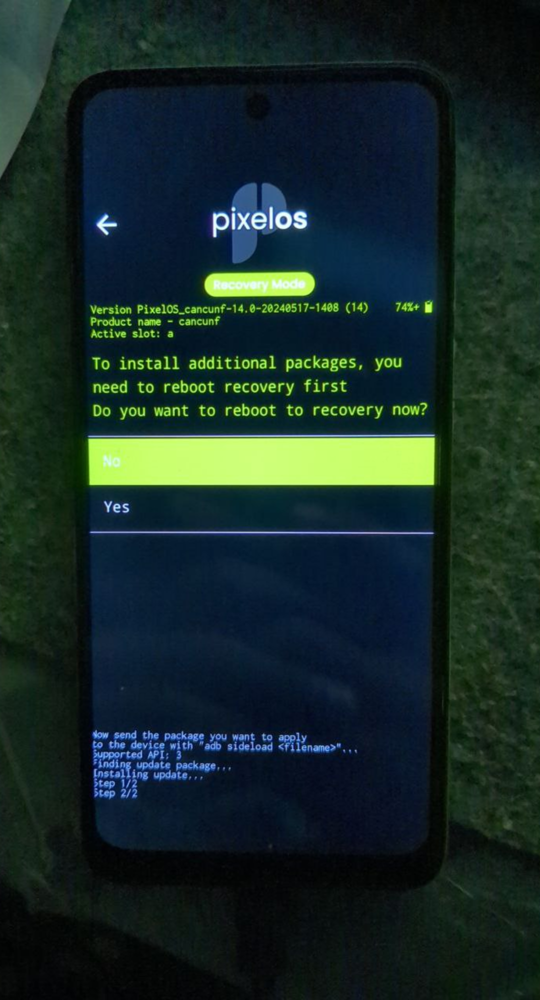

# **Flashing custom recovery and custom ROMs**

## Flashing Recovery  

- Download your recovery image from your preferred rom post and place it in platform-tools folder
- Boot your device to [bootloader mode](bl_unlock.md#3booting-to-booloader-mode)
- Flash the recovery image  
      - Type the below command in [command prompt](bl_unlock.md#step-2-setup-platform-tools) and hit enter to flash the custom recovery.

```
fastboot flash vendor_boot vendor_boot.img

```

!!! info "Info"
    Attach vendor_boot.img in place of vendor_boot.img

## Reboot to recovery mode

### Method 1

- Type the below command in [command prompt](bl_unlock.md#step-2-setup-platform-tools) and hit enter to reboot into `recovery mode`

```
fastboot reboot recovery 
```

### Method 2

- Enter fastboot mode.
- Use the volume key to select Recovery and press power button to boot into recovery.

The phone will reboot into `recovery mode` and will look like something this

{ style="width: 50%; display: block; margin-left: auto; margin-right: auto;" }

## Flashing ROM

!!! warning "Warning"
     Make sure that any slot must not be empty, means if u have ever used blankflash or flashed stock ROM using RSA then make sure u got any ota. Else don't flash.

- **Download the ROM**:
      - Download the ROM of your choice. Verify the [MD5 checksum](https://www.geeksforgeeks.org/md5sum-linux-command/) to verify package integrity.

- **Format Data**

!!! info "Info"
    You must format data if you are flashing for the first time or switching roms

- **Apply Update in Recovery**:
      - Boot into recovery mode.
      - Select "Apply update" opton.

{ style="width: 50%; display: block; margin-left: auto; margin-right: auto;" }

- **Choose Update Source**:

  - Select either pendrive, external SD card, or ADB sideload.
    - for ADB sideload, type: `adb sideload <rom.zip>`.
    - Replace `<rom.zip>` with the filename you downloaded, if you haven't used it yet.
    - for external storage, navigate to the location of the downloaded file and flash.

- **Flash ROM**:
      - The process will proceed to 47% and then ask if you want to reboot to flash additional packages. Select "Yes" or "No". It doesn't matter what you choose.

{ style="width: 50%; display: block; margin-left: auto; margin-right: auto;" }

{ style="width: 50%; display: block; margin-left: auto; margin-right: auto;" }

- **Reboot to System**  

      - Reboot your phone to the system.

!!! success "Congratulations!!"
    Your new custom ROM has been installed.
